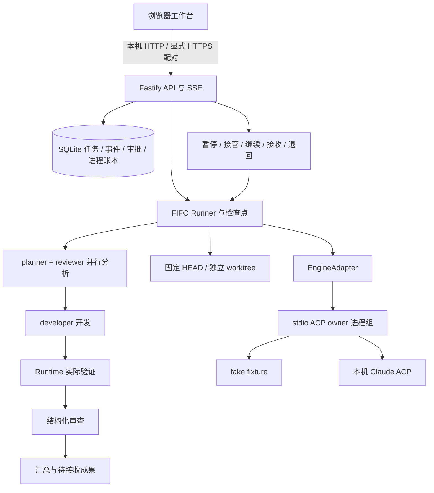

# 分享与交付证据

源码交付入口是 [README](../README.md)，首次体验用无模型 demo。分享材料应说明实际运行条件、验证范围和限制；本指南不表示代码已经公开发布、推送或安装公网入口。

## 已验证与待验证

| 范围 | 已记录证据 | 实际限制 |
| --- | --- | --- |
| 持久任务与 fake ACP | 创建落库、事件/成果、幂等、状态与异常路径 | fake 不证明真实模型或代码生成 |
| Claude 最小开发 | greeting fixture 的真实多阶段执行、补丁和实际测试，见 [阶段二](phase2-acceptance.md) | 绑定当时主机的 provider，不保证其他机器认证 |
| 控制与恢复 | 暂停/接管/继续、审批、旧 attempt、实际崩溃和归属核验，见 [阶段三](phase3-acceptance.md) | 单机持久恢复，不是容灾或自动重放 |
| 鉴权与工作台 | 撤销、CSRF、SSE-auth、390px/1600px 隔离浏览器，见 [阶段四](phase4-acceptance.md) | 测试设备与 HTTP 开发模式，不是生产手机或 TLS 验收 |
| 历史全量 | macOS arm64、Node 22.18.0/24.18.0：530 项、29 文件、无跳过 | 不推广到新提交或新主机 |
| 2026-10-06 交付 | `8ac1c02`：MacBook 两个 Node 版本与 M1 独立目录各 605 项、33 文件、无跳过；Chrome fake 与 M1 探针，见 [当日报告](delivery-acceptance-2026-10-06.md) | 历史证据；断网/401 为拦截模拟，390px 不是实体手机 |
| 2026-10-07 收尾 | `39fe311` 干净独立安装、Node 24.18.0 全量 605/605、doctor/smoke/HTTP demo、fake 中断重试和冷恢复；今日真实 fixture 5 阶段/5 AgentRun、Runtime 3/3、8 成果，见 [今日验收](delivery-acceptance.md) | 今日只重跑本机全量；真实任务复用当日既有证据；M1 生产未升级或故障注入 |
| HTTP 正式启动 | loopback HTTP fake 任务及 SQLite 一致性可单独验收 | 不等于局域网或移动网络访问 |
| 远程使用 | paired 代码和 Named Tunnel 占位说明已准备 | 真实 HTTPS、固定域名、手机移动网络流程待配置和验收 |
| 操作系统 | macOS arm64 有实机运行与测试证据 | Linux 需实机复验，Windows 进程管理未适配 |
| 持续可用性 | 持久事件、幂等控制与恢复门禁 | 无冗余、故障切换、自动运维或零停机升级 |

新增验收记录日期、提交 SHA、OS/架构、Node 版本、完整命令、测试数、退出码/跳过数、真实 socket 与模型范围及清理结果。历史阶段记录保留原结论；当前结果放新验收记录，不改写历史。

完整中文分享初稿为 [让 Agent 接得住任务：一台电脑上的执行、接管与恢复](article-draft.zh-CN.md)。本轮只保存本地草稿；项目当前声明 Apache-2.0，公开发布待用户批准。

## 可复现演示

无需账号的顺序：安装锁定依赖 → build → smoke → `npm run demo` → 查看预置成功/故障任务 → 创建 fake 任务 → 接收 → 刷新 → Ctrl+C。自动 `npm run demo -- --check` 检查 HTTP/SQLite 后退出。命令、期望结果和持久启动见 [首次运行](getting-started.md)。

技术演示用 `npm run fixture` 建立无敏感专用仓库，说明宿主 WIP、HEAD 基线和独立 worktree。具备本机已有认证且允许真实模型调用后，才运行 Claude；展示 Runtime 实际测试和补丁，再讲接管、继续与交付。录制时避开无关任务、配对链接、Cookie、provider 文件及其他仓库。

全量验证：

```sh
node --version
npm ci --ignore-scripts --registry=https://registry.npmjs.org --strict-ssl=true
npm run build
npm run doctor
npm run typecheck
PERSONAL_AGENT_SSE_REAL_SOCKETS=1 npm test -- --maxWorkers=1 --minWorkers=1
npm run smoke
npm run demo -- --check
npm run build
```

在目标机重新记录结果。默认不发模型请求；全量测试的临时虚拟身份不能与生产票据混称。固定文本探针明确 `authenticatedPrompt: "passed"` 才证明模型往返；真实开发任务另有流水线证据。

源码维护者另在 Git 检出目录运行 `npm run share:check` 和 `git diff --check`；没有 `.git` 的源码包按随包 SHA-256 清单核验。

## 架构与讲解提纲



建议 8 分钟讲解：

1. **问题与范围（1 分钟）**：个人执行节点、浏览器控制、Agent 分工；当前本机可用，远程需独立验收。
2. **无账号演示（2 分钟）**：fake 创建、事件、成果、接收、失败和后续正常任务。
3. **真实开发机制（2 分钟）**：worktree 排除宿主 WIP；双分析、实际验证和审查；成果不自动合并。
4. **人的控制（1 分钟）**：要求从下一阶段生效，接管先停止进程，审批必须明确处理，completed 与 accepted 不同。
5. **可靠性（1 分钟）**：事务、commandId、SSE seq 补发、attempt 隔离、先登记后执行及恢复门禁。
6. **证据与下一步（1 分钟）**：报实际环境和用例数，区分 fake/模型/浏览器/手机跨网，说明单机与平台限制。

## 源码与敏感信息检查

只导出选定、已检查的提交。`.gitignore` 排除 node_modules、构建产物、`.data`、数据库、日志和 `.env`，但不会移除已跟踪文件，仍须检查 Git 清单和导出包。输出目录须已存在，归档文件须尚不存在，避免覆盖先前材料。

```sh
npm run share:check
git status --short
git ls-files
git diff --check
# 替换为审阅过的固定提交；输出位置必须已经存在且获准用于本地材料
git archive --format=tar.gz \
  --output='<LOCAL_OUTPUT_DIR>/personal-agent-source.tar.gz' \
  '<REVIEWED_COMMIT_SHA>'
tar -tzf '<LOCAL_OUTPUT_DIR>/personal-agent-source.tar.gz'
```

`share:check` 检查跟踪文件和许可材料，不创建公开仓库、不推送、不归档运行数据。关键字扫描仅辅助人工审阅，发现可疑内容先定位脱敏，不将原值输出到分享报告；通过也不是绝对无秘密保证。

这项维护命令需要 Git 检出目录；导出的源码包没有 `.git`，接收者用随包提交标识和 SHA-256 清单核验内容，随后执行 build、测试和 demo。

分享前核对：

- 保留 LICENSE、NOTICE、package-lock.json、README 和运行/维护说明。
- 不含 `.git` 历史、`.deployment`、`.data`、任务数据库、模型目录、SSH/Cloudflare 凭据、`.env`、缓存、日志、备份或未脱敏截图。
- 源码、文档和脚本无真实账号、内网 IP、个人 HOME、token、Cookie、票据、私钥、任务正文；示例统一用通用占位值。
- 归档只含审阅过的跟踪文件，不直接压缩整个工作目录，不复制 node_modules 或运行数据，不抓取秘密制作 demo。
- 预构建产物单独标明提交、平台和生成方式，保留对应源码及第三方许可。接收机器从官方注册表按锁重装依赖。

本地分享材料不自动触发发布、推送、域名绑定或生产配对。

## 许可证与固定来源

项目当前声明 [Apache License 2.0](../LICENSE)；公开发布待用户批准，本轮没有发布或更改许可证。`packages/runtime/src/engine-process.ts` 适配自 `nuwax-ai/nuwa-cli` 的 `src/core/processes/killTree.ts`，固定来源提交、修改说明和许可见 [NOTICE](../NOTICE) 及文件头；其 Apache 来源和归属要求必须保留，不带入相邻项目 WIP。

ACP SDK 与 Claude ACP 为独立依赖；其传递依赖包含采用 Anthropic 商业条款的 SDK/二进制，不能把整个安装目录统一称为 Apache-2.0。完整版本、许可与分发边界见 [第三方许可说明](third-party-licenses.md)。当前源码归档不捆绑 node_modules、dist 或二进制；如分发预构建产物，另行逐项审核所含许可和归属文件。

## 首次交付门槛

接收者能从新源码和新数据按 README 完成 fake demo，命令、预期输出和错误处理可复现。升级者能识别数据目录、冷备份、匹配源码和登记路径，按 [运行维护](operations.md) 停止与恢复。验收清单明确当前版本通过项和未完成项。

远程交付另须验证固定 HTTPS origin、代理 Host/SSE、生产 paired、指定设备，以及手机关闭 Wi-Fi 后的任务、审批、接管、重连、接收与撤销。未完成这些实测时应标注“本机可用、远程待验收”。
